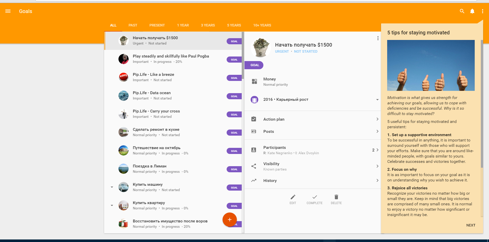
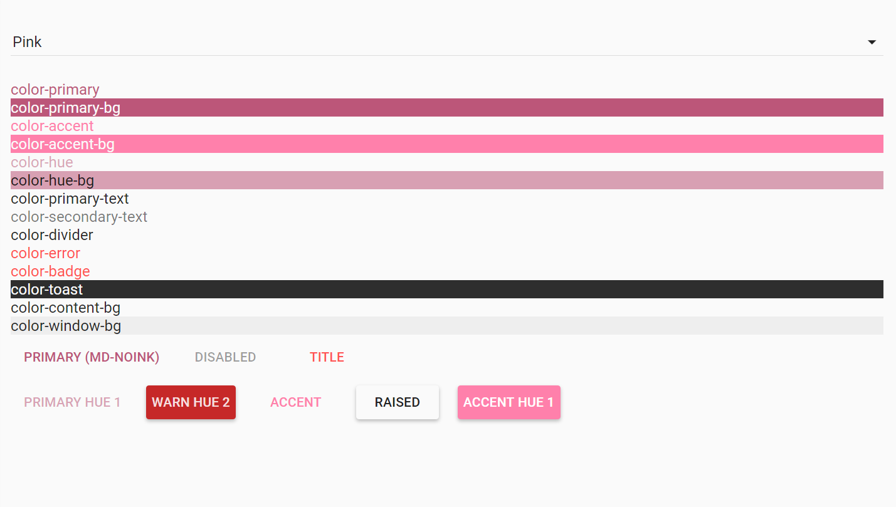
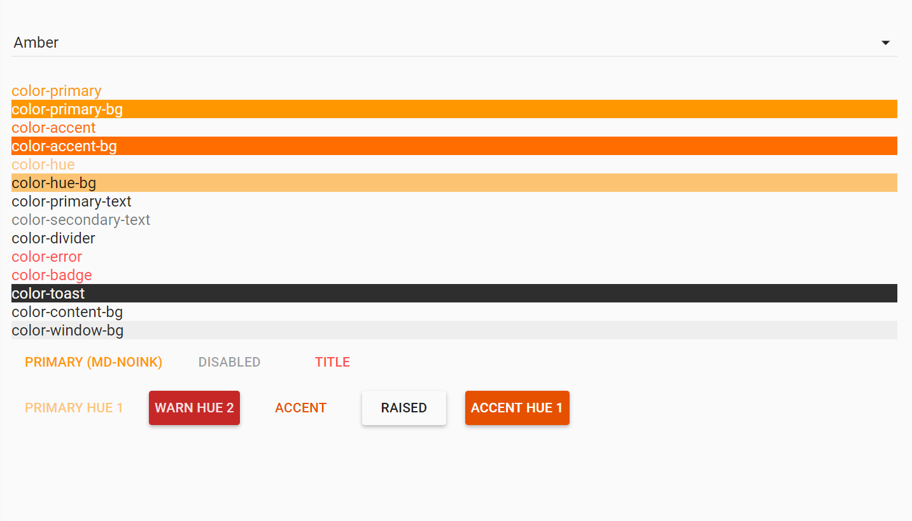
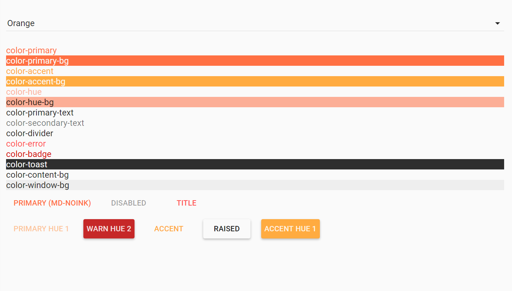
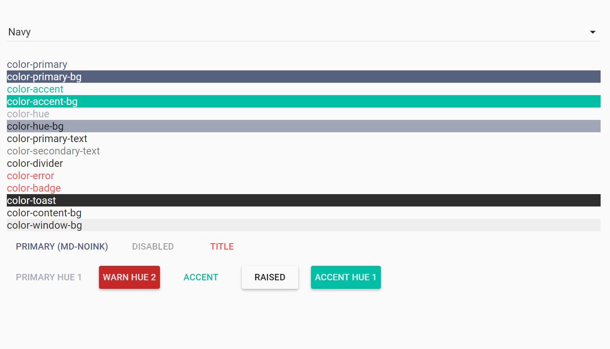
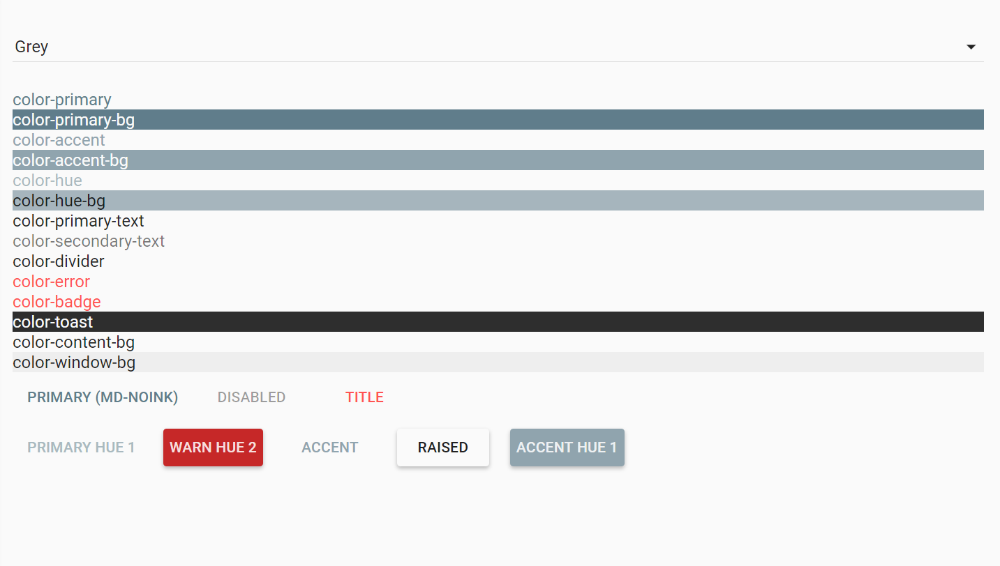
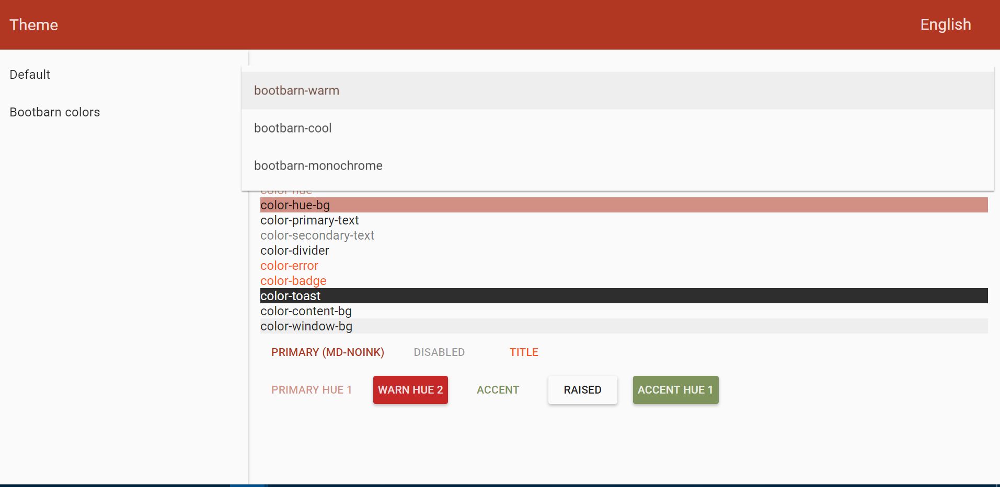
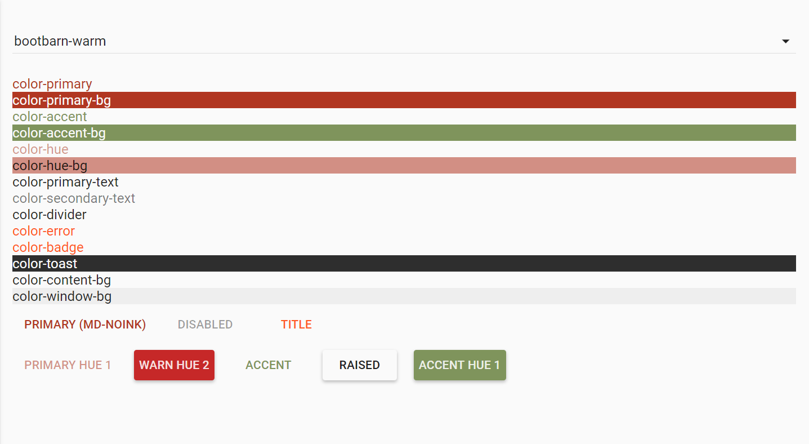
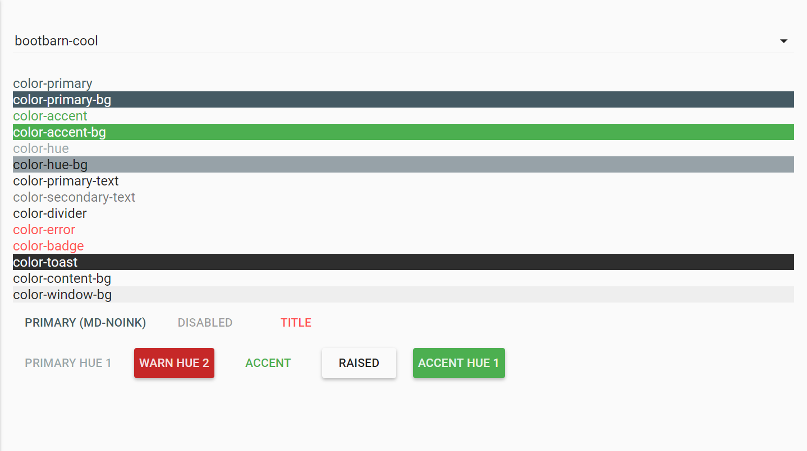
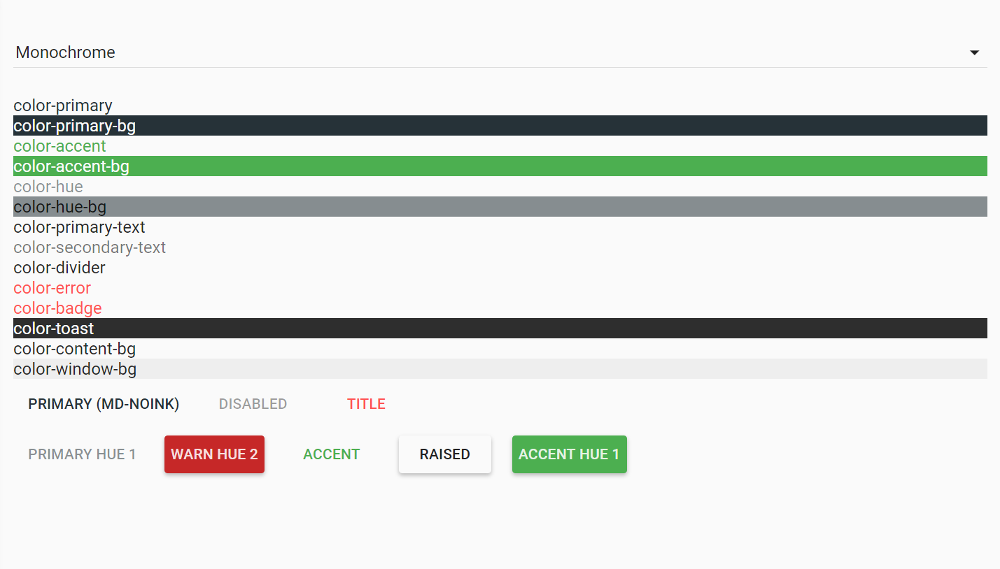

#  <br/> Color Themes


Pip.WebUI.Themes module contains a mechanism to define and dynamically switch color themes for both Angular Material and custom controls.

**pipTheme** service allows to change color themes in the application.

Register **pipTheme** module in angular module dependencies.
```javascript
angular.module('myApp',[..., 'pipTheme']);
```
Use **setCurrentTheme** function for change current theme.
Use **initializeTheme** function if you want use css classes for theme colors. You need to call this function after initializing the theme with $mdThemingProvider.

In **Pip.WebUI.Themes** module has Default and Bootbarn configuration. You can also add existing themes: blue, pink, green, amber, orange, 

**Default Themes** configuration includes blue, pink, amber, orange, green, navy and grey themes.
Register **pipTheme.Default** module in angular module dependencies before registration **pipTheme** module.



**Blue Theme** configuration includes blue theme.


**Pink Theme** configuration includes pink theme.


**Amber Theme** configuration includes Amber theme.


**Orange theme** configuration includes orange theme.


**Green theme** configuration includes green theme.


**Navy Theme** configuration includes navy theme.


**Grey Theme** configuration includes grey theme.


**Bootbarn Themes** configuration includes bootbarn-warm, bootbarn-monochrome and bootbarn-cool themes.


**Bootbarn Warm Theme** configuration includes bootbarn-warm theme.


**Bootbarn Cool Theme** configuration includes bootbarn-cool theme.


**Bootbarn Monochrome Theme** configuration includes bootbarn-monochrome theme.


And more... Please, look at [User's guide](https://github.com/pip-webui/pip-webui-themes/blob/master/doc/UsersGuide.md) for details.


## Learn more about the module

- [User's guide](https://github.com/pip-webui/pip-webui-themes/blob/master/doc/UsersGuide.md)
- [Online samples](http://webui.pipdevs.com/pip-webui-themes/index.html)
- [API reference](http://webui-api.pipdevs.com/pip-webui-themes/index.html)
- [Developer's guide](https://github.com/pip-webui/pip-webui-themes/blob/master/doc/DevelopersGuide.md)
- [Changelog](https://github.com/pip-webui/pip-webui-themes/blob/master/CHANGELOG.md)
- [Pip.WebUI project website](http://www.pipwebui.org)
- [Pip.WebUI project wiki](https://github.com/pip-webui/pip-webui/wiki)
- [Pip.WebUI discussion forum](https://groups.google.com/forum/#!forum/pip-webui)
- [Pip.WebUI team blog](https://pip-webui.blogspot.com/)

## <a name="dependencies"></a>Module dependencies

* [pip-webui-lib](https://github.com/pip-webui/pip-webui-lib): angular, angular material and other 3rd party libraries

## <a name="license"></a>License

This module is released under [MIT license](License) and totally free for commercial and non-commercial use.
