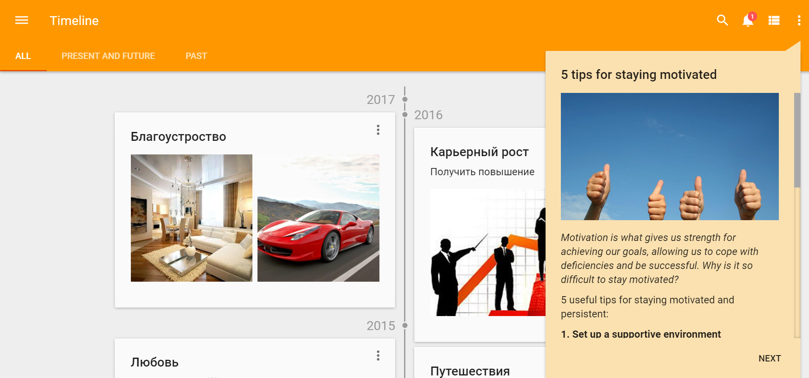

#  <br/> Color Themes


Pip.WebUI.Themes module contains a mechanism to define and dynamically switch color themes for both Angular Material and custom controls.

**pipTheme** service allows to change color themes in the application.

Register **pipTheme** module in angular module dependencies.
```javascript
angular.module('myApp',[..., 'pipTheme']);
```
Use **setCurrentTheme** function for change current theme.
Use **initializeTheme** function if you want use css classes for theme colors. You need to call this function after initializing the theme with $mdThemingProvider.

In **Pip.WebUI.Themes** module has Default and Bootbarn configuration. You can also add existing themes: blue, pink, green, amber, orange, 

**Default Themes** configuration includes blue, pink, amber, orange, green, navy and grey themes.
Register **pipTheme.Default** module in angular module dependencies before registration **pipTheme** module.



Register **pipTheme** module in angular module dependencies.
```javascript
angular.module('myApp',[..., 'pipTheme.Default', 'pipTheme']);
```

For change theme use **pipTheme.setCurrentTheme(theme);** function

You can register **Custom Theme**. 
Configuring of the default theme is done by using the $mdThemingProvider during application configuration.
You can specify a color palette for a given color intention by calling the appropriate configuration method (theme.primaryPalette, theme.accentPalette, theme.warnPalette, theme.backgroundPalette).

```javascript
(function () {
    'use strict';
    var thisModule = angular.module('pipTheme.Green', ['ngMaterial']);

    thisModule.config(config);

    function config($mdThemingProvider, pipTranslateProvider) {

        var greenBackgroundPalette = $mdThemingProvider.extendPalette('grey', {
            'A100': 'rgba(250, 250, 250, 1)',
            'A200': 'rgba(76, 175, 80, 1)'
        });
        $mdThemingProvider.definePalette('green-background', greenBackgroundPalette);

        var greenPrimaryPalette = $mdThemingProvider.extendPalette('green', {
            '300': '#9ed4a1',
            'contrastLightColors': ['500', '300']
        });
        $mdThemingProvider.definePalette('green-primary', greenPrimaryPalette);

        var greenAccentPalette = $mdThemingProvider.extendPalette('amber', {
            'contrastLightColors': ['A700']
        });
        $mdThemingProvider.definePalette('green-accent', greenAccentPalette);

        $mdThemingProvider.theme('green')
            .primaryPalette('green-primary', {
                'default': '500',
                'hue-1': '300'
            })
            .backgroundPalette('green-background', {
                'default': '50',  
                'hue-1': 'A200',  
                'hue-2': 'A700'   
            })
            .warnPalette('red', {
                'default': 'A200'
            })
            .accentPalette('green-accent', {
                'default': 'A700'
            });
        $mdThemingProvider.alwaysWatchTheme(true);
    }
})();
```

You may add variables for themes class and after call mixin **generate-theme**.
In project needs add **pip-webui-css.less** wich you find in /dist [pip-webui-css](https://github.com/pip-webui/pip-webui-css).

```less
@color-green-theme:
        @color-green-primary // primary color
        @color-green-accent  // accent color
        @color-green-hue    // primary color wich some opacity
        @color-primary    // text color  
        @color-secondary  // text color with some opacity 
        @color-green-error // error color
        @color-divider  // color for dividers  
        @color-toast    // background color for toasts    
        @color-green-error // background color for badge   
        @color-content // background color for content window
        @color-window // background color for window
        @color-green-accent-hue; // accent color wich some opacity

.generate-theme(green, @color-green-theme);
```

You can use theme in html
```html
    // Use theme class in html
    <div class="color-primary"> color-primary</div>
    <div class="color-primary-bg"> color-primary-bg</div>
    <div class="color-accent"> color-accent</div>
    <div class="color-accent-bg"> color-accent-bg</div>
    ...
    <md-button class="md-primary md-hue-1">Primary Hue 1</md-button>
```

And more... Please, look at [User's guide](https://github.com/pip-webui/pip-webui-themes/blob/master/doc/UsersGuide.md) for details.

## Learn more about the module

- [User's guide](https://github.com/pip-webui/pip-webui-themes/blob/master/doc/UsersGuide.md)
- [Online samples](http://webui.pipdevs.com/pip-webui-themes/index.html)
- [API reference](http://webui-api.pipdevs.com/pip-webui-themes/index.html)
- [Developer's guide](https://github.com/pip-webui/pip-webui-themes/blob/master/doc/DevelopersGuide.md)
- [Changelog](https://github.com/pip-webui/pip-webui-themes/blob/master/CHANGELOG.md)
- [Pip.WebUI project website](http://www.pipwebui.org)
- [Pip.WebUI project wiki](https://github.com/pip-webui/pip-webui/wiki)
- [Pip.WebUI discussion forum](https://groups.google.com/forum/#!forum/pip-webui)
- [Pip.WebUI team blog](https://pip-webui.blogspot.com/)

## <a name="dependencies"></a>Module dependencies

* [pip-webui-lib](https://github.com/pip-webui/pip-webui-lib): angular, angular material and other 3rd party libraries

## <a name="license"></a>License

This module is released under [MIT license](License) and totally free for commercial and non-commercial use.
