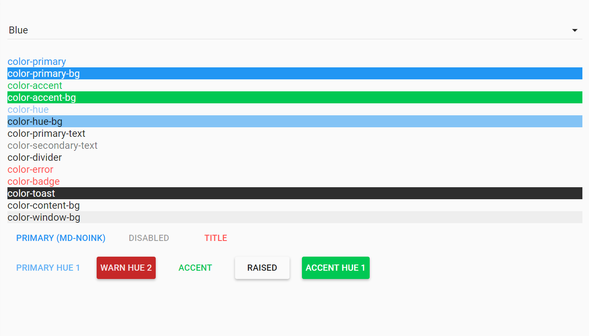
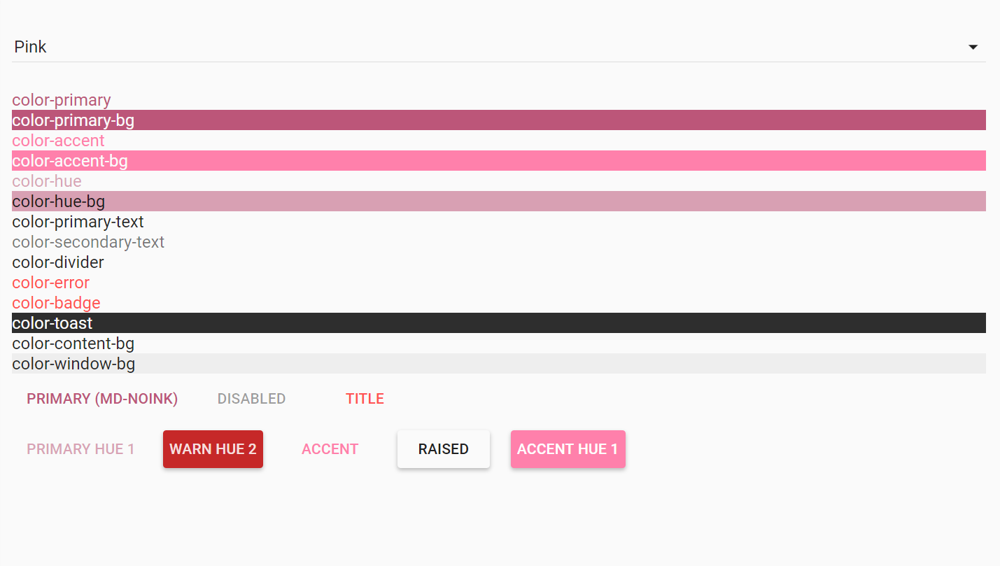
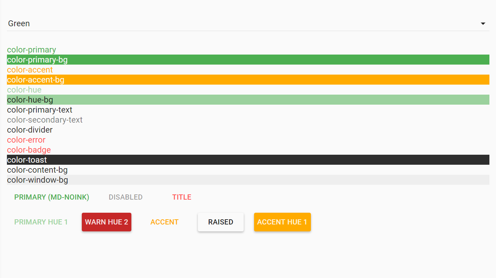
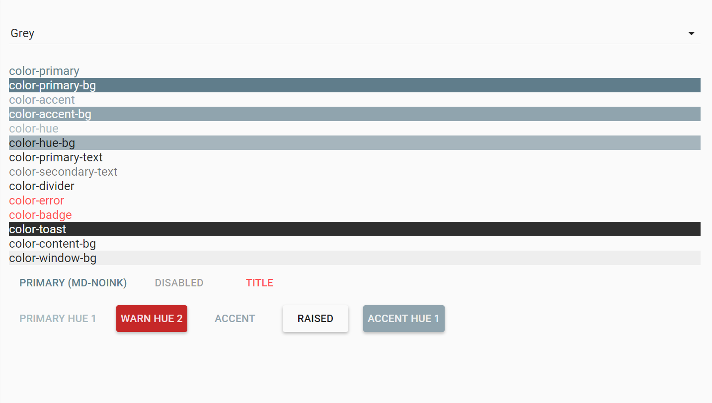
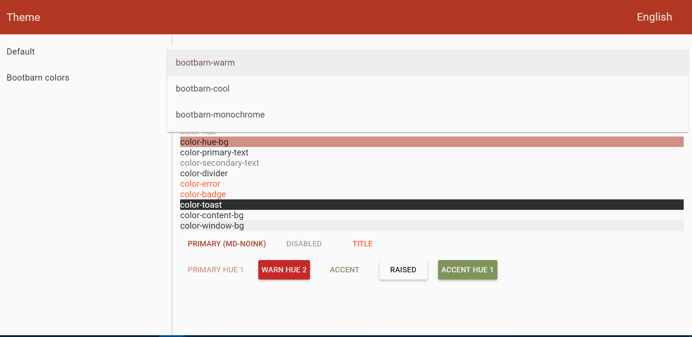
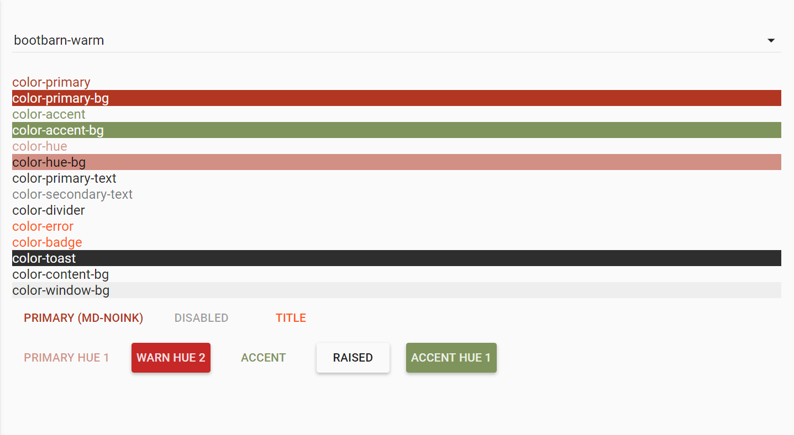
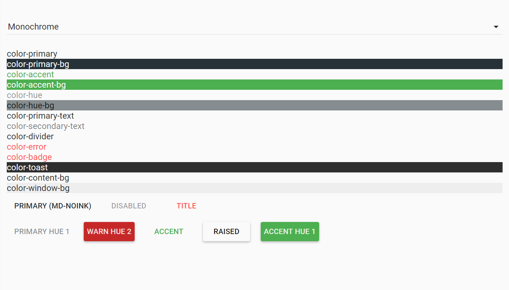

# Pip.WebUI.Themes User's Guide

## <a name="contents"></a> Contents
- [Installing](#install)
- [Default Themes](#def_themes)
- [Blue Theme](#blue_theme)
- [Pink Theme](#pink_theme)
- [Amber Theme](#amber_theme)
- [Orange Theme](#orange_theme)
- [Green Theme](#green_theme)
- [Navy Theme](#navy_theme)
- [Grey Theme](#grey_theme)
- [Bootbarn Themes](#bootbarn_themes)
- [Warm Theme](#warm_theme)
- [Cool Theme](#cool_theme)
- [Monochrome Theme](#monochrome_theme)
- [Themes Service](#theme)
- [Custom Theme](#custom)
- [Questions and bugs](#issues)


## <a name="install"></a> Installing

Add dependency to **pip-webui** into your **bower.json** or **package.json** file depending what you use.
```javascript
"dependencies": {
  ...
  "pip-webui": "*"
  ...
}
```

Alternatively you can install **pip-webui** manually using **bower**:
```bash
bower install pip-webui
```

or install it using **npm**:
```bash
npm install pip-webui
```

Include **pip-webui** files into your web application.
```html
<link rel="stylesheet" href=".../pip-webui-lib.min.css"/>
<link rel="stylesheet" href=".../pip-webui.min.css"/>
...
<script src=".../pip-webui-lib.min.js"></script>
```

Register **pipTheme** module in angular module dependencies.
```javascript
angular.module('myApp',[..., 'pipTheme']);
```

If you want add default themes add **pipTheme.Default** module in angular module dependencies.
```javascript
angular.module('myApp',[..., 'pipTheme.Default', 'pipTheme']);
```

If you want add bootbarn themes add **pipTheme.Bootbarn** module in angular module dependencies.
```javascript
angular.module('myApp',[..., 'pipTheme.Bootbarn', 'pipTheme']);
```

## <a name="def_themes"></a> Default Themes

**pipTheme.Default** configuration includes blue, pink, amber, orange, green, navy and grey themes.

### Usage

Register **pipTheme.Default** module in angular module dependencies before registration **pipTheme** module.
```javascript
angular.module('myApp',[..., 'pipTheme.Default', 'pipTheme']);
```


## <a name="blue_theme"></a> Blue Theme

**pipTheme.Blue** configuration includes blue theme.

### Usage

Register **pipTheme.Blue** module in angular module dependencies before registration **pipTheme** module.
```javascript
angular.module('myApp',[..., 'pipTheme.Blue', 'pipTheme']);
```



## <a name="pink_theme"></a> Pink Theme

**pipTheme.Pink** configuration includes pink theme.

### Usage

Register **pipTheme.Pink** module in angular module dependencies before registration **pipTheme** module.
```javascript
angular.module('myApp',[..., 'pipTheme.Pink', 'pipTheme']);
```



## <a name="amber_theme"></a> Amber Theme

**pipTheme.Amber** configuration includes Amber theme.

### Usage

Register **pipTheme.Amber** module in angular module dependencies before registration **pipTheme** module.
```javascript
angular.module('myApp',[..., 'pipTheme.Amber', 'pipTheme']);
```


## <a name="orange_theme"></a> Orange Theme

**pipTheme.Orange** configuration includes orange theme.

### Usage

Register **pipTheme.Orange** module in angular module dependencies before registration **pipTheme** module.
```javascript
angular.module('myApp',[..., 'pipTheme.Orange', 'pipTheme']);
```


## <a name="green_theme"></a> Green Theme

**pipTheme.Green** configuration includes green theme.

### Usage

Register **pipTheme.Green** module in angular module dependencies before registration **pipTheme** module.
```javascript
angular.module('myApp',[..., 'pipTheme.Green', 'pipTheme']);
```



## <a name="navy_theme"></a> Navy Theme

**pipTheme.Navy** configuration includes navy theme.

### Usage

Register **pipTheme.Navy** module in angular module dependencies before registration **pipTheme** module.
```javascript
angular.module('myApp',[..., 'pipTheme.Navy', 'pipTheme']);
```


## <a name="grey_theme"></a> Grey Theme

**pipTheme.Grey** configuration includes grey theme.

### Usage

Register **pipTheme.Grey** module in angular module dependencies before registration **pipTheme** module.
```javascript
angular.module('myApp',[..., 'pipTheme.Grey', 'pipTheme']);
```



## <a name="def_themes"></a> Bootbarn Themes

**pipTheme.Bootbarn** configuration includes bootbarn-warm, bootbarn-monochrome and bootbarn-cool themes.

### Usage

Register **pipTheme.Bootbarn** module in angular module dependencies before registration **pipTheme** module.
```javascript
angular.module('myApp',[..., 'pipTheme.Bootbarn', 'pipTheme']);
```



## <a name="warm_theme"></a> Bootbarn Warm Theme

**pipTheme.Bootbarn.Warm** configuration includes bootbarn-warm theme.

### Usage

Register **pipTheme.Bootbarn.Warm** module in angular module dependencies before registration **pipTheme** module.
```javascript
angular.module('myApp',[..., 'pipTheme.Bootbarn.Warm', 'pipTheme']);
```



## <a name="cool_theme"></a> Bootbarn Cool Theme

**pipTheme.Bootbarn.Cool** configuration includes bootbarn-cool theme.

### Usage

Register **pipTheme.Bootbarn.Cool** module in angular module dependencies before registration **pipTheme** module.
```javascript
angular.module('myApp',[..., 'pipTheme.Bootbarn.Cool', 'pipTheme']);
```


## <a name="monochrome_theme"></a> Bootbarn Monochrome Theme

**pipTheme.Bootbarn.Monochrome** configuration includes bootbarn-monochrome theme.

### Usage

Register **pipTheme.Bootbarn.Monochrome** module in angular module dependencies before registration **pipTheme** module.
```javascript
angular.module('myApp',[..., 'pipTheme.Bootbarn.Monochrome', 'pipTheme']);
```



## <a name="themes"></a> Themes Service

**pipTheme** service allows to change color themes in the application.

### Usage

Register **pipTheme** module in angular module dependencies.
```javascript
angular.module('myApp',[..., 'pipTheme']);

...

 thisModule.controller('MyController',
    function (pipTheme) {
        $scope.setCurrentTheme = setCurrentTheme;

        return;

        function setCurrentTheme(theme) {
            pipTheme.setCurrentTheme(theme);
        };
    })
```

### Methods

* **setCurrentTheme** - change current theme. Parameters: *theme* - name of a previously initialized theme.
* **initializeTheme** - initialize theme in application after initialize theme with $mdTheming provider in config. Parameters: *theme* - name of a previously initialized theme.


## <a name="custom"></a> Custom Theme

### Register theme with $mdThemingProvider

You can register custom theme. 
Configuring of the default theme is done by using the $mdThemingProvider during application configuration.
You can specify a color palette for a given color intention by calling the appropriate configuration method (theme.primaryPalette, theme.accentPalette, theme.warnPalette, theme.backgroundPalette).

#### Usage

```javascript
(function () {
    'use strict';
    var thisModule = angular.module('pipTheme.Green', ['ngMaterial']);

    thisModule.config(config);

    function config($mdThemingProvider, pipTranslateProvider) {

        var greenBackgroundPalette = $mdThemingProvider.extendPalette('grey', {
            'A100': 'rgba(250, 250, 250, 1)',
            'A200': 'rgba(76, 175, 80, 1)'
        });
        $mdThemingProvider.definePalette('green-background', greenBackgroundPalette);

        var greenPrimaryPalette = $mdThemingProvider.extendPalette('green', {
            '300': '#9ed4a1',
            'contrastLightColors': ['500', '300']
        });
        $mdThemingProvider.definePalette('green-primary', greenPrimaryPalette);

        var greenAccentPalette = $mdThemingProvider.extendPalette('amber', {
            'contrastLightColors': ['A700']
        });
        $mdThemingProvider.definePalette('green-accent', greenAccentPalette);

        $mdThemingProvider.theme('green')
            .primaryPalette('green-primary', {
                'default': '500',
                'hue-1': '300'
            })
            .backgroundPalette('green-background', {
                'default': '50',  
                'hue-1': 'A200',  
                'hue-2': 'A700'   
            })
            .warnPalette('red', {
                'default': 'A200'
            })
            .accentPalette('green-accent', {
                'default': 'A700'
            });
        $mdThemingProvider.alwaysWatchTheme(true);
    }
})();

```
#### Methods

* **$mdThemingProvider.extendPalette** - extend some default palette.
* **$mdThemingProvider.definePalette** - add new palette in palette array
* **$mdThemingProvider.theme** - register new theme
* **$mdThemingProvider.alwaysWatchTheme** - add watch for theme change

### Add css variables and styles 

You may add variables for themes class and after call mixin **generate-theme**.
In project needs add **pip-webui-cssframework.less** wich you find in /dist [pip-webui-cssframework](https://github.com/pip-webui/pip-webui-cssframework).

#### Usage

```less
@color-bootbarn-warm-theme:
        @color-bootbarn-warm-primary // primary color
        @color-bootbarn-warm-accent  // accent color
        @color-bootbarn-warm-hue    // primary color wich some opacity
        @color-primary    // text color  
        @color-secondary  // text color with some opacity 
        @color-bootbarn-warm-error // error color
        @color-divider  // color for dividers  
        @color-toast    // background color for toasts    
        @color-bootbarn-warm-error // background color for badge   
        @color-content // background color for content window
        @color-window // background color for window
        @color-bootbarn-warm-accent-hue; // accent color wich some opacity

.generate-theme(bootbarn-warm, @color-bootbarn-warm-theme);
```

In final you have next css classes:

**color-primary** - primary color
**color-primary-bg** - background color primary
**color-accent** - color accent
**color-accent-bg** - background color accent
**color-accent-hue-bg** - background color accent with opacity
**color-hue** - primary color with opacity
**color-hue-bg** - background is primary color with opacity
**color-primary-text** - text color 
**color-secondary-text**  - secondary text color 
**color-divider** - color of divider 
**color-badge** - color for badges
**color-badge-bg** - background color for badges
**color-error** - color for errors
**color-toast** - background color for toast 
**color-content-bg** - background content
**color-window-bg** - background window
**color-disabled** - disabling color
**color-disabled-bg** - background wich  disabling color

## <a name="issues"></a> Questions and bugs

If you have any questions regarding the module, you can ask them using our 
[discussion forum](https://groups.google.com/forum/#!forum/pip-webui).

Bugs related to this module can be reported using [github issues](https://github.com/pip-webui/pip-webui-themes/issues).
